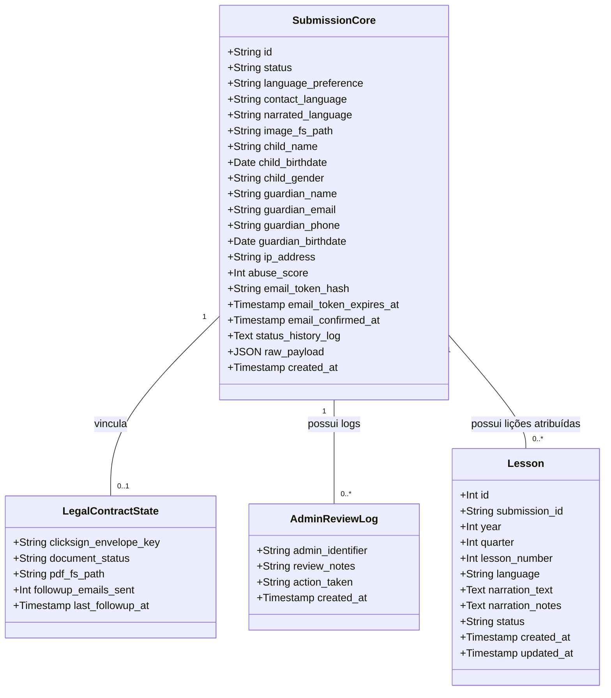
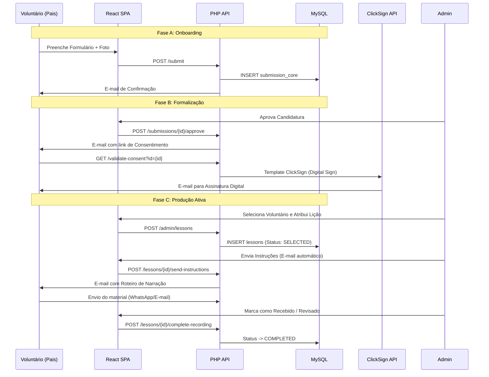

# Daora Kids - DK Forms v0.28.0 (Headless SPA) 📝

Módulo de gestão do funil de voluntariado da plataforma Daora Kids. Este sistema gerencia desde a candidatura inicial até a formalização jurídica e a entrega final de materiais de narração através de uma esteira de produção ativa, agora com suporte total a comunicação multilíngue personalizada.

## 🏗️ Arquitetura e Fluxos

O sistema segue uma arquitetura **Headless** com uma SPA em React no frontend e uma API RESTful em PHP 8 no backend.

### 1. Diagrama de Classes (Modelo de Dados)

### 2. Fluxo de Operação (Sequência)

O diagrama abaixo ilustra a interação entre o Voluntário, a SPA em React, o Backend PHP e as APIs externas.

Para uma descrição verbal completa de cada etapa, consulte: 👉 **[Documentação de Workflow (BPM)](./workflow.md)**

## 📊 Inteligência e Monitoramento (Dashboard)

O Dashboard Administrativo atua como um centro de comando da produção:

1.  **Funil de Conversão:** Visualização em tempo real de quantos candidatos estão em cada etapa crítica (Inscritos -> Confirmados -> Formalizados -> Concluídos).
2.  **Gestão de Backlog:** Indicador de voluntários aptos que ainda não receberam instruções de gravação.
3.  **Fila de Curadoria:** Destaque para materiais recebidos que aguardam revisão técnica.
4.  **SLA Automático:** O sistema monitora prazos de 7 dias para confirmação de e-mail e 14 dias para assinatura de contrato, cancelando registros inativos automaticamente via Pseudo-Cron.

## 🛠️ Tecnologias Utilizadas
- **Frontend**: React 19, Tailwind CSS, Lucide Icons, Framer Motion.
- **Backend**: PHP 8 (Pure), PDO MySQL.
- **Integrações**: ClickSign (Assinatura), Cloudflare Turnstile (Segurança), AbuseIPDB (Detecção de Fraude).

## 🔐 Segurança e Performance
- **Zero Inline Styles**: Todo o design é baseado em utilitários CSS e Tailwind.
- **Semantic Keys**: Abandono de siglas legadas em favor de nomes claros para facilitar auditoria e manutenção.
- **Audit Log**: Sistema de log atômico (`status_history_log`) que registra cada ação humana ou automática no registro.
- **Auto-Healing**: O sistema detecta a ausência de tabelas de produção e as cria automaticamente na primeira carga administrativa.

---
© 2026 Daora Kids Project.
